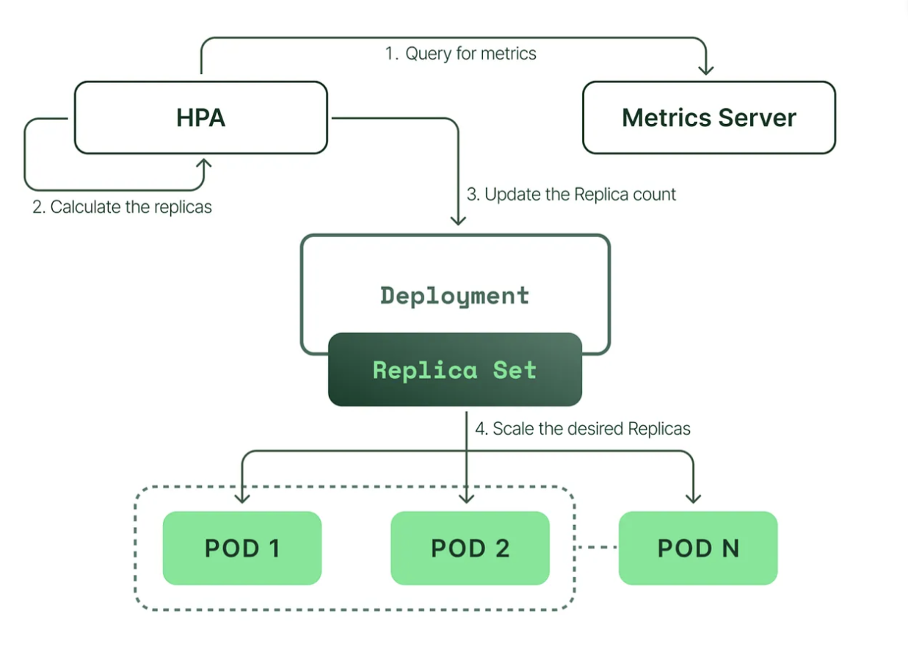

We cannot sit around 24/7 and change the replicas we need based on the demand. There are 2 basic types of auto scaling in k8's Horizantal Autoscaling, Vertical Autoscaling.

Horizonatal Autoscaling added more number of pods/nodes to the node or reduces the pods/nodes.
Vertical Autoscaling adds more resources to a single pod/node based on the demand.

Horizontal Pod Autoscaler(HPA) comes within k8s which takes care of scaling the pods and it takes the conditinal metrics from metric server.
VPA for scaling the pods vertically.
Cluster Autoscaler takes care of scaling nodes in a cluster usually comes with cloud provider.
Node Auto provisiong for vertical scaling of node from cloud provider.

other autoscaling methods are Event based: KEDA, Cron based autoscaling.

kubectl autoscale deployment autoscale-deployment --cpu-percent=50 --min=1 --max=4

 kubectl run -i --tty load-generator --rm --image=busybox:1.28 --restart=Never -- /bin/sh -c "while sleep 0.01; do wget -q -O- http://php-apache; done"

To simulate the load on the application.

creates a HPA which periodcally monitors the cpu metrics and takes action accordingly.

